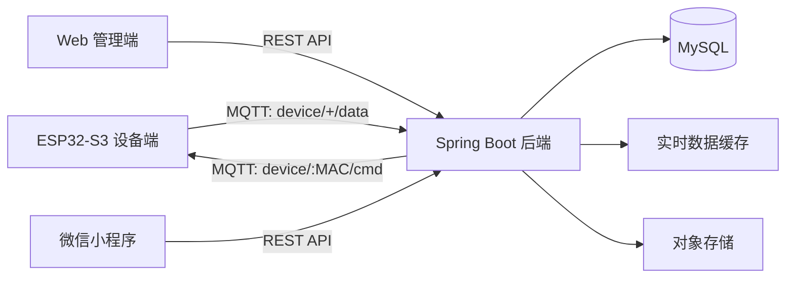

# iot-warehouse

应急智慧仓储系统：基于 Spring Boot、MyBatis、MySQL 和 MQTT 的物联网仓储管理后端，支持环境数据监测、设备控制、RFID 出入库、库存预警、告警处理和统计看板。

## 项目亮点

- Java 17 + Spring Boot + MyBatis 后端分层架构，覆盖设备、传感器数据、告警、物资、库存、出入库记录、用户等模块。
- 基于 MQTT 接入 ESP32-S3 设备数据，订阅 `device/+/data`，并通过 `device/{deviceId}/cmd` 下发阈值配置和控制指令。
- 使用 MySQL 建模 12 张核心业务表，支撑设备配置、传感器历史数据、RFID 库存明细、出入库流水、库存告警等业务。
- 通过内存实时缓存 + 数据变化阈值 + 最小入库间隔控制传感器历史数据写库频率，兼顾最新数据读取和历史数据存储。
- 支持 RFID 写卡预登记、待入库记录、入库/出库状态流转和出入库流水生成。
- 基于 Spring 事件和定时任务实现库存不足/库存积压告警扫描，支持告警新增、更新、自动恢复和人工处理闭环。
- 使用 JWT + 拦截器实现登录鉴权，并在设备管理、设备配置场景下区分管理员和普通用户权限。
- 提供 Dockerfile 与 Docker Compose，支持 MySQL、后端服务、前端静态资源的一体化部署。

## 技术栈

| 模块 | 技术 |
| --- | --- |
| 后端 | Java 17, Spring Boot, Spring MVC, MyBatis |
| 数据库 | MySQL, Mapper XML, SQL 统计查询 |
| 设备通信 | MQTT, Eclipse Paho |
| 鉴权 | JWT, HandlerInterceptor |
| 部署 | Docker, Docker Compose, Nginx |
| 前端协作 | Vue, Element UI, ECharts |
| 设备端协作 | ESP32-S3, RFID, 环境传感器 |

## 系统架构



## 后端模块

- 设备管理：设备注册、设备状态、设备分配、设备控制指令下发。
- 设备配置：阈值配置、工作模式、报警模式、配置下发。
- 传感器数据：最新数据、历史数据、时间范围查询、入库限流。
- RFID 出入库：写卡预登记、待入库记录、入库/出库状态流转。
- 物资库存：物资分类、物资档案、库存明细、库存汇总。
- 告警处理：设备告警、库存告警、告警统计、告警处理闭环。
- 统计看板：今日操作、设备在线状态、未处理告警、库存预警、出入库趋势。
- 用户权限：JWT 登录认证、管理员/普通用户设备权限控制。

## 核心代码位置

```text
backend/src/main/java/com/hstk/iot_warehouse
├── controller      # REST API
├── service         # 业务逻辑
├── mapper          # MyBatis Mapper
├── component       # MQTT 监听、实时缓存、库存扫描、RFID 缓存
├── interceptor     # 登录鉴权拦截器
├── model           # entity / dto / vo
└── config          # MQTT、CORS、Web 配置
```

关键文件：

- `component/MqttListener.java`：MQTT 消息接入、RFID 处理、传感器数据缓存与异步落库。
- `controller/IotDeviceController.java`：设备管理、设备权限、设备控制指令下发。
- `controller/IotDeviceConfigController.java`：阈值配置保存与 MQTT 下发。
- `service/impl/WmsStockItemServiceImpl.java`：库存统计、库存告警扫描与自动恢复。
- `component/StockAlarmScanner.java`：启动扫描与定时库存告警扫描。
- `interceptor/LoginCheckInterceptor.java`：JWT 登录态校验。

## 数据库设计

核心表包括：

- `sys_user`：系统用户。
- `iot_device`：设备信息。
- `iot_device_config`：设备阈值与模式配置。
- `iot_device_user`：设备授权关系。
- `iot_sensor_data`：传感器历史数据。
- `iot_switch_log`：设备控制日志。
- `iot_alarm`：设备告警与库存告警。
- `wms_category`：物资分类。
- `wms_material`：物资档案。
- `wms_location`：库位信息。
- `wms_stock_item`：RFID 库存实物明细。
- `wms_io_record`：出入库流水。

## 本地运行

### 1. 准备环境变量

复制 `.env.example` 并填写数据库、JWT 和对象存储配置：

```bash
cp .env.example .env
```

### 2. 启动服务

```bash
docker compose -f docker-compose.lite.yml up -d
```

### 3. 后端单独运行

```bash
cd backend
./mvnw spring-boot:run
```

默认后端地址：

```text
http://localhost:8080
```

## 接口示例

```http
POST /login
GET  /devices
POST /devices/{deviceId}/cmd
GET  /device-configs/{deviceId}
POST /device-configs
GET  /sensor-data/latest?deviceId={deviceId}
GET  /alarms
PUT  /alarms/{alarmId}/resolve
GET  /stock/summary
GET  /stats/dashboard
```

## 后续优化

- 使用 BCrypt 存储用户密码。
- 补充接口文档和 Swagger/OpenAPI。
- 增加 Service 层单元测试和接口集成测试。
- 将 MQTT 消息处理拆分为更细的策略类，降低 `MqttListener` 复杂度。
- 对传感器历史数据增加按时间分区或归档策略。
